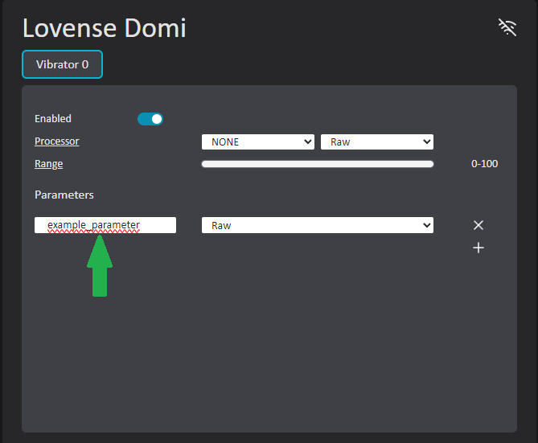

# VibeCheck

An app to connect bluetooth sex toys to your VRChat avatar using VRChat's OSC implementation.

[Supported Toys](https://iostindex.com/?filter0ButtplugSupport=4)

### VibeCheck 0.2 is in Beta Testing and will be getting updates frequently.

**Please report bugs/issues or feature requests if you have them!**

## TL;DR

- Get requirements for [Bluetooth](./docs/Bluetooth.md#requirements) or [Lovense Connect](./docs/LovenseConnect.md#requirements)
- [Download Installer](https://github.com/SutekhVRC/VibeCheck/releases/latest) and Install VibeCheck.
- Setup avatar to send a synced float parameter (or multiple float parameters) to utilize OSC and send input to VibeCheck. You probably want to drive the parameters with [Avatar Dynamics Contacts](https://docs.vrchat.com/docs/contacts) scripts.
- Start VibeCheck and turn on toy(s)
- Search for toy(s) and configure

# Avatar Setup

You can do whatever you want you don't NEED to use contacts scripts. VibeCheck just listens for OSC parameters.

### VibeCheck Standard Tags

- Using standard tags allows people to generally be setup for people without having to match tags and re-upload avatars. I recommend unchecking 'Allow Self' to avoid triggering your own toys.
- Standard tag: 'vibecheck_tag'

### Steps

- Setup your avatar to have a [VRChat Contact Receiver](https://docs.vrchat.com/docs/contacts#vrccontactreceiver) wherever you want the toy(s) to be controlled from.
- Ex. A contact receiver sphere in the hips area would control the toy(s) when a contact sender with a matching collision tag enters the receiver sphere. The contact receiver **MUST** be in proximity mode to function correctly, because VibeCheck expects float input from VRChat. **NOTE:** (Capsule mode does not work with Proximity)
- If you want another person to be able to interact with your receiver make sure they add the matching collision tags to their [VRChat Contact Senders](https://docs.vrchat.com/docs/contacts#vrccontactsender).
- The parameter(s) you enter into the contact receivers are the parameters you will assign to toys in the VibeCheck app.

# Avatar Configuration

### OSC

- VibeCheck can be configured so that each feature/motor of a toy is assigned to different OSC addresses.
- VibeCheck only reads Float parameters.
- If you add a parameter to an avatar remember to refresh the OSC config. I do this by deleting the OSC configuration files for my avatars and then changing out and back in to my avatar. The button in game never works for me.

# VibeCheck App Setup

1. Run VibeCheck.
2. If VibeCheck is your only OSC app that receives data from VRChat, skip step 3.
3. If you are using multiple OSC apps that **Receive** data from VRChat consider using my OSC router app: [VOR](https://github.com/SutekhVRC/VOR/releases/latest). Then go to the 'Settings' tab and setup VibeCheck's OSC bind host/port to listen on.
4. Setup connection via [Bluetooth](./docs/Bluetooth.md) or [Lovense Connect](./docs/LovenseConnect.md), and turn on your toy(s).
5. Once your toy(s) are connected, configure them to use the parameters you want them to listen for (Floats only). You have full control of the parameter address to listen for. So you will have to input the whole parameter address. You will almost always only need to use the avatar parameters address. So inputting your parameter will follow this format: /avatar/parameters/YOUR_CONTACTS_RECEIVER_PARAMETER_HERE. So if I put the parameter name 'vtest' into my contacts receiver on my avatar I would input '/avatar/parameters/vtest' for my parameter in the toy's configuration.

6. Once your toy is configured/saved press on switch in the bottom left to start using VibeCheck with VRChat.
7. Once you are in VRChat you will need to enable OSC in the expressions menu. If you have used OSC before with your avatar, remember to refresh the OSC config for that avatar (In the OSC expressions menu OR delete the avatar's OSC config file adn re-load the avatar).
8. You should be all set now. Enjoyyyyyy ;}

### Enable/Disable OSC command

- VibeCheck will listen for the boolean parameter 'vibecheck/state' to be true or false. If true it will enable and scan for 10 seconds. If false it will disable the app.

### Toy Settings (Wrench Icon)

- OSC Data: Click the checkbox to enable a float to be sent to VRChat that is the battery life of the toy. You can use this parameter in your avatar's animation controllers. Click the address bar to copy the parameter.

# Credits

- TutiDore: Frontend developer.
- [DigiGhost](https://twitter.com/digi_ghost): Commissioned Artist (Icons and Banners).
- [Tini](https://vrchat.com/home/user/usr_7d526959-f3ab-4226-aa82-dba613df998e): Helped with frontend UI mockups and testing.

Thanks to the people below for testing and suggestions!

- Googii
- Buneskapp
- MikuLove
- Kali
- Nitro
