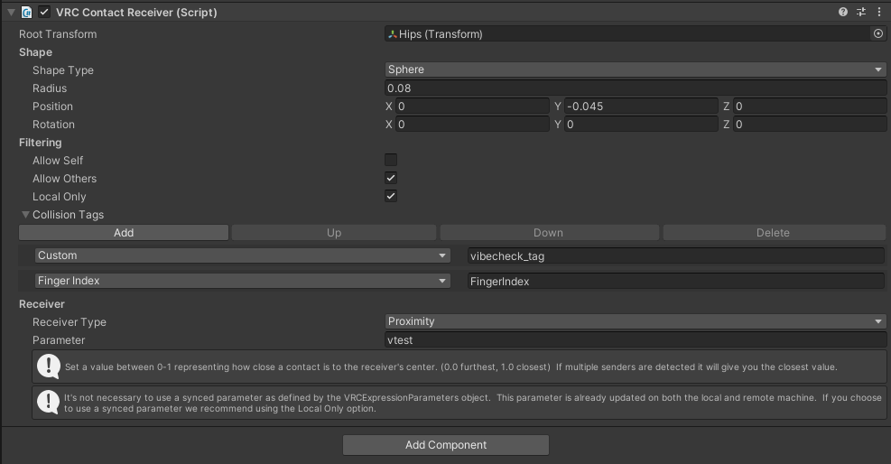
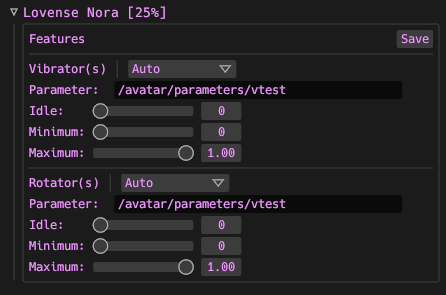

# VibeCheck
An app to connect bluetooth sex toys to your VRChat avatar using VRChat's OSC implementation.

### VibeCheck 2.0 is in Beta Testing and will be getting updates frequently.
**Please report bugs/issues or feature requests if you have them!**

## Socials
- [VRChat Group](https://vrc.group/VIBE.9503)
- [SutekhVRC Discord](https://discord.gg/g6kUFtMtpw)

## VibeCheck 2.0 Credits
- Sutekh: Lead developer and backend dev.
- TutiDore: Frontend developer.
- DigiGhost: Commissioned Artist (Icons and Banners).
- Tini: Helped with frontend UI mockups and testing.

## Thanks
Thanks to the people below for testing and suggestions!
- Googii
- Buneskapp
- MikuLove
- Kali
- Nitro

## Buttplug IO Supported Toys
- [Supported Toys (All)](https://iostindex.com/?filter0ButtplugSupport=4)
- [Supported Toys (Lovense)](https://iostindex.com/?filter0ButtplugSupport=4&filter1Brand=Lovense)

## Dependencies
- (Lovense Connect Only) Lovense Connect app on phone / Lovense Connect adapter for PC Lovense Connect app.
- (Bluetooth LE Only) A bluetooth LE adapter. You will definitely want one with a reasonable range.

## TL;DR
- Install [Dependencies](https://github.com/SutekhVRC/VibeCheck#dependencies) and have a bluetooth adapter.
- [Download Installer](https://github.com/SutekhVRC/VibeCheck/releases/latest) and Install VibeCheck.
- Setup avatar to send a synced float parameter (or multiple float parameters) to utilize OSC and send input to VibeCheck. You probably want to drive the parameters with [Avatar Dynamics Contacts](https://docs.vrchat.com/docs/contacts) scripts.
- Start VibeCheck
- Turn on toy(s)
- Press 'Search for toys' button.
- Configure toy(s) in VibeCheck.
- Press the on/off switch in the bottom left to enable the connection to/from VRChat, (Make sure VRChat has OSC enabled and your avatar OSC file is up to date).
- Note: You can change toy configurations while the app is enabled.

## Install Instructions

### Install VibeCheck

- Download and install the MSI from the [latest version of VibeCheck](https://github.com/SutekhVRC/VibeCheck/releases/latest).

### Avatar Setup (You can do whatever you want you don't NEED to use contacts scripts. VibeCheck just listens for OSC parameters.)

#### VibeCheck Standard Tags
- Using standard tags allows people to generally be setup for people without having to match tags and re-upload avatars. I recommend unchecking 'Allow Self' to avoid triggering your own toys.
- Standard tag: 'vibecheck_tag'

#### Steps

- Setup your avatar to have a [VRChat Contact Receiver](https://docs.vrchat.com/docs/contacts#vrccontactreceiver) wherever you want the toy(s) to be controlled from.
- Ex. A contact receiver sphere in the hips area would control the toy(s) when a contact sender with a matching collision tag enters the receiver sphere. The contact receiver **MUST** be in proximity mode to function correctly, because VibeCheck expects float input from VRChat. **NOTE:** (Capsule mode does not work with Proximity)
- If you want another person to be able to interact with your receiver make sure they add the matching collision tags to their [VRChat Contact Senders](https://docs.vrchat.com/docs/contacts#vrccontactsender).
- The parameter(s) you enter into the contact receivers are the parameters you will assign to toys in the VibeCheck app.

## VibeCheck App Setup

1. Run VibeCheck.
2. If VibeCheck is your only OSC app that receives data from VRChat, skip step 3.
3. If you are using multiple OSC apps that **Receive** data from VRChat consider using my OSC router app: [VOR](https://github.com/SutekhVRC/VOR/releases/latest). Then go to the 'Settings' tab and setup VibeCheck's OSC bind host/port to listen on.
4. Make sure your [connection method is setup](https://github.com/SutekhVRC/VibeCheck#connection-methods), and turn on your toy(s).
5. Once your toy(s) are connected, configure them to use the parameters you want them to listen for (Floats only). You have full control of the parameter address to listen for. So you will have to input the whole parameter address. You will almost always only need to use the avatar parameters address. So inputting your parameter will follow this format: /avatar/parameters/YOUR_CONTACTS_RECEIVER_PARAMETER_HERE. So if I put the parameter name 'vtest' into my contacts receiver on my avatar I would input '/avatar/parameters/vtest' for my parameter in the toy's configuration.

6. Once your toy is configured/saved press on switch in the bottom left to start using VibeCheck with VRChat.
7. Once you are in VRChat you will need to enable OSC in the expressions menu. If you have used OSC before with your avatar, remember to refresh the OSC config for that avatar (In the OSC expressions menu OR delete the avatar's OSC config file adn re-load the avatar).
8. You should be all set now. Enjoyyyyyy ;}

### Feature Modifiers
- Enabled: Enable/Disabled feature.
- OSC Parameter: OSC address/parameter to listen for.
- Smoothing: Smooths the float inputs received from OSC.
- Idle: The idle level of the feature. Idle starts once the feature has been triggered for the first time.
- Minimum: The minimum level the feature is allowed to be active at. Minimum does not influence idle.
- Maximum: The maximum level the feature is allowed to be active at. Maximum does not influence idle.

## Connection methods

### Bluetooth LE adapter

- Make sure to disable all bluetooth radio adapters except the one you are using for VibeCheck.
- Plug in your Bluetoopth adapter.
- Start VibeCheck
- Turn on toys

#### Bluetooth Pros/Cons

- Pros
    - Supports many different toys.

- Cons
    - If the Bluetooth LE adapter used doesn't have good range it could be a less stable connection than Lovense Connect.

### Lovense Connect

- Make sure the VibeCheck PC and your phone or computer running Lovense Connect are on the same network/subnet
- Connect your toys to Lovense Connect
- It may take like 30 seconds for Lovense Connect to update their NAT punchtrough API
- Press Enable!

#### Lovense Connect Pros/Cons

- Pros
    - Easy to use.
    - If using Lovense Connect phone app as long as your phone is connected to the same network as your PC running vibecheck,and your toy is near your phone. You can technically be as far away as your phone can connect to your wifi and it will still take input from VibeCheck!

- Cons
    - Can only use with Lovense toys.

### Connect using both methods at the same time

- Connect your toys to the Lovense Connect app.
- Turn on bluetooth toys and press "Search for toys".
- VibeCheck should show both Bluetooth and Lovense Connect toys!

## General

VibeCheck functions by receiving OSC input from VRChat.

# FAQ

## Connection issues

### Common Lovense Connect Issues
  - I recommend using VibeCheck's Lovense Connect Host Override setting. Enter the LAN IP address for the device running Lovense Connect. If you are using desktop Lovense Connect you can use 127.0.0.1 as the IP address.
  - Start Lovense Connect **before** starting VibeCheck (If you are using VibeCheck 0.1.x).
  - Sometimes Lovense API servers are slow or are down, this can cause Lovense Connect to not function correctly. I have added to my fork of the buttplug library to allow Lovense Connect host overriding. This will bypass relying on the Lovense API to discover LAN devices.
  - The device running Lovense Connect is on a different subnet than the computer running VibeCheck. Make sure your phone or computer running Lovense Connect are on the same network as the computer running VibeCheck.
  - Lovense Connect Desktop app failing to register the correct interface can be caused by VPN / VM network interfaces and others alike. Remove virtual networks and disable VPN's.

### Common Bluetooth Issues
  - Your Bluetooth adapter may just be really weak (Feel free to ask for Bluetooth adapter recommendations)
  - Make sure your Bluetooth adapter/dongle supports LE
  - If your computer has an onboard bluetooth interface, make sure it is disabled if you are using another bluetooth interface (USB Bluetooth dongle).
  - [Motherboard integrated bluetooth radios interfering](https://kb.plugable.com/bluetooth-adapter/your-computer-has-had-a-different-bluetooth-adapter-previously-or-has-a-built-in-adapter)
  - Windows only supports the use of 1 generic bluetooth interface at a time.
  - [Windows OS only supports the use of 1 Bluetooth radio](https://docs.microsoft.com/en-us/windows-hardware/drivers/bluetooth/bluetooth-faq#how-many-bluetooth-radios-can-windows-support)
  - If you are using VibeCheck before version 0.1.9 make sure to plug in the bluetooth adapter before starting VibeCheck.

## How to connect

### Lovense Connect
  - Download Lovense Connect for phone or desktop.
  - If using Lovense Connect on desktop you will need the Lovense USB dongle.
  - Connect toys to Lovense Connect
  - Start VibeCheck (Sometimes you may need to wait like 10 - 20 seconds if the Lovense API is being slow)

### Bluetooth
  - You need a Bluetooth LE adapter.
    - Note on Bluetooth LE adapters: I recommend using an adapter that can handle more than one device and has a **strong/long-range** connection.
  - Make sure any onboard generic bluetooth interfaces are disabled.
  - Plug in the Bluetooth LE adapter

## Pros, Cons, Lovense Connect or Bluetooth?

### Bluetooth Mode

#### Pros
 - Generally has a faster response time
 - Supports many different toys.

#### Cons
- Can be less stable than Lovense Connect if the Bluetooth LE adapter in use isn't very strong.

### Lovense Connect Mode

#### Pros
  - Can be a more stable alternative if you dont have a very good bluetooth LE adapter
  - Don't need to buy any adapters if you have a smart phone and WiFi.
  - Can use Lovense Connect on phone to take advantage of your WiFi's range.

#### Cons
  - Can only be used with Lovense Toys.
  - If Lovense API is down you cannot use it.

## Avatar Configuration

### OSC

  - VibeCheck can be configured so that each feature/motor of a toy is assigned to different OSC addresses.
  - VibeCheck only reads Float parameters.
  - If you add a parameter to an avatar remember to refresh the OSC config. I do this by deleting the OSC configuration files for my avatars and then changing out and back in to my avatar. The button in game never works for me.