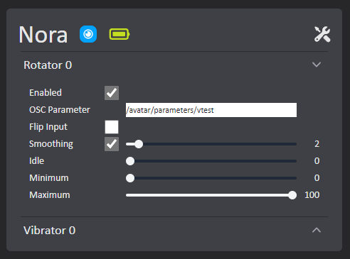

### VibeCheck is in Beta Testing and will be getting updates frequently.
## VibeCheck rewrite complete (0.1.1)!
### Features added:

    - Supports Bluetooth LE and Lovense Connect
    - Feature input smoothing and feature disabling/enabling
    - Support for other toy feature types like Max 2 Constriction for example. (Only through bluetooth)
    - VibeCheck now checks if it is up to date and if not, displays an "Update" button that will close and update VibeCheck.
    - No longer relies on IntifaceCLI!
    - Can use Lovense Connect toys and bluetooth toys at the same time

### Bug fixes:

    - CEH bug with battery querying toys and crashing if no response from toy.

### Optimizations

    - Toy input optimizations (Smoothing itself is also an optimization technically)
    - OSC listener optimizations
    - No longer relies on IntifaceCLI!

**Please report bugs/issues or feature requests if you have them!**

# VibeCheck

An app to connect bluetooth sex toys to your VRChat avatar using VRChat's OSC implementation.

[SutekhVRC Discord](https://discord.gg/SC3W6YwPHs)

## Buttplug IO Supported Toys
- [Supported Toys (All)](https://iostindex.com/?filter0ButtplugSupport=4)
- [Supported Toys (Lovense)](https://iostindex.com/?filter0ButtplugSupport=4&filter1Brand=Lovense)

## Common Windows OS Bluetooth radio issues
- [Windows OS only supports the use of 1 Bluetooth radio](https://docs.microsoft.com/en-us/windows-hardware/drivers/bluetooth/bluetooth-faq#how-many-bluetooth-radios-can-windows-support)
- Motherboard integrated bluetooth radios commonly have connection issues without an antenna, as well as can only handle one connected device.
- Motherboard integrated bluetooth radios will interfere with external bluetooth adapters (USB adapters / etc.).
- [Motherboard integrated bluetooth radios interfering](https://kb.plugable.com/bluetooth-adapter/your-computer-has-had-a-different-bluetooth-adapter-previously-or-has-a-built-in-adapter)

## Common Lovense Connect issues
- Toys not showing up in VibeCheck: Sometimes Lovense Connect can be slow updating their NAT punchthrough API and you just have to wait for it to populate. (If you have waited for a good amount of time restarting vibecheck will force check the NAT punchthrough API for Lovense to detect your toy)
- Another reason a toy may not show up on the Lovense Connect NAT punchthrough API is that you have multiple subnets in your network. (Make sure that the computer or phone using the Lovense Connect app is on the same network/subnet as the computer with VibeCheck running.)
- Using a VPN can cause issues
- You can check if your toys and lovense connect app is detected by lovense servers by going to the LC Debug tab and clicking refresh or visit [here](https://api.lovense.com/api/lan/getToys).

## Dependencies
- (Lovense Connect Only) Lovense Connect app on phone / Lovense Connect adapter for PC Lovense Connect app
- (Bluetooth Only) A bluetooth LE adapter. I recommend [this one](https://www.amazon.com/dp/B09DMP6T22?psc=1&ref=ppx_yo2ov_dt_b_product_details)

## TL;DR
- Install [Dependencies](https://github.com/SutekhVRC/VibeCheck#dependencies) and have a bluetooth adapter.
- [Download Installer](https://github.com/SutekhVRC/VibeCheck/releases/latest) and Install VibeCheck.
- Setup avatar to send a synced float parameter (or multiple float parameters) to utilize OSC and send input to VibeCheck. You probably want to drive the parameters with [Avatar Dynamics Contacts](https://docs.vrchat.com/docs/contacts) scripts.
- Start VibeCheck
- Turn on toy(s) (If toy is supported it will autoconnect)
- Configure toy(s) in VibeCheck.
- Save the toy configuration when done.
- Press "Enable" to start receiving input from VRChat, (Make sure VRChat has OSC enabled and your avatar OSC file is up to date)
- Note: You can change toy configurations while the app is enabled.

## Install Instructions

### Install VibeCheck

- Download and install the MSI from the [latest version of VibeCheck](https://github.com/SutekhVRC/VibeCheck/releases/latest).

### Avatar Setup (You can do whatever you want you don't NEED to use contacts scripts. VibeCheck just listens for OSC parameters.)

#### VibeCheck Standard Tags
- Using standard tags allows people to generally be setup for people without having to match tags and re-upload avatars. I recommend unchecking 'Allow Self' to avoid triggering your own toys.
- Standard tag: 'vibecheck_tag'

#### Steps

- Setup your avatar to have a [VRChat Contact Receiver](https://docs.vrchat.com/docs/contacts#vrccontactreceiver) wherever you want the toy(s) to be controlled from.
- Ex. A contact receiver sphere in the hips area would control the toy(s) when a contact sender with a matching collision tag enters the receiver sphere. The contact receiver **MUST** be in proximity mode to function correctly, because VibeCheck expects float input from VRChat. **NOTE:** (Capsule mode does not work with Proximity)
- If you want another person to be able to interact with your receiver make sure they add the matching collision tags to their [VRChat Contact Senders](https://docs.vrchat.com/docs/contacts#vrccontactsender).
- The parameter(s) you enter into the contact receivers are the parameters you will assign to toys in the VibeCheck app.

## VibeCheck App Setup

1. Run VibeCheck.
2. If VibeCheck is your only OSC app that receives data from VRChat, skip step 3.
3. If you are using multiple OSC apps that **Receive** data from VRChat consider using my OSC router app: [VOR](https://github.com/SutekhVRC/VOR/releases/latest). Then go to the 'Settings' tab and setup VibeCheck's OSC bind host/port to listen on.
4. Make sure your [connection method is setup](https://github.com/SutekhVRC/VibeCheck#connection-methods), and turn on your toy(s).
5. Once your toy(s) are connected, configure them to use the parameters you put in the Contacts Receiver scripts. Click on the toy's features you want to configure, and click 'Edit' on the feature u want to configure. The edit mode will look different depending on the toy being used. You have full control of the parameter address to listen for. So you will have to input the whole parameter address. You will almost always only need to use the avatar parameters address. So inputting your parameter will follow this format: /avatar/parameters/YOUR_CONTACTS_RECEIVER_PARAMETER_HERE. So if I put the parameter name 'vtest' into my contacts receiver on my avatar I would input '/avatar/parameters/vtest' for my parameter in the toy's configuration. Once you are done press 'Save'.

6. Once your toy is configured/saved press 'Enable' to start using VibeCheck with VRChat.
7. Once you are in VRChat you will need to enable OSC in the expressions menu. If you have use OSC before with your avatar, remember to refresh the OSC config for that avatar (In the OSC expressions menu OR delete the avatar's OSC config file).
8. You should be all set now. Enjoyyyyyy ;}

### Feature Modifiers

- Idle: The idle level of the feature. Idle starts once the feature has been triggered for the first time.
- Minimum: The minimum level the feature is allowed to be active at. Minimum does not influence idle.
- Maximum: The maximum level the feature is allowed to be active at. Maximum does not influence idle.

## Connection methods

### Bluetooth LE adapter

- Make sure to disable all bluetooth radio adapters except the one you are using for VibeCheck.
- Plug in your Bluetoopth adapter.
- Start VibeCheck
- Turn on toys
- When toys are connected click enable!

#### Bluetooth Pros/Cons

- Pros
    - Supports many different toys.
    - Supports more features of toys like Constriction on Max 2 for example.

- Cons
    - Less stable connection than Lovense Connect.

### Lovense Connect

- Make sure the VibeCheck PC and your phone or computer running Lovense Connect are on the same network/subnet
- Connect your toys to Lovense Connect
- It may take like 30 seconds for Lovense Connect to update their NAT punchtrough API
- You can check if your toys and lovense connect app is detected by lovense servers by going to the LC Debug tab and clicking refresh or visit [here](https://api.lovense.com/api/lan/getToys).
- Start VibeCheck: VibeCheck should find your Lovense Connect toys from the Lovense API. (Check the LC Debug tab. Click "Refresh" to see if Lovense has detected your toys.) If not wait a bit longer.
- Press Enable!

#### Lovense Connect Pros/Cons

- Pros
    - More stable connection than Bluetooth LE.
    - Easy to use.
    - If using Lovense Connect phone app as long as your phone is connected to the same network as your PC running vibecheck,and your toy is near your phone. You can technically be as far away as your phone can connect to your wifi and it will still take input from VibeCheck!

- Cons
    - Can only use with Lovense toys.
    - Only Vibration/Rotation/Linear features are supported.

### Connect using both methods at the same time

- Connect your toys to the Lovense Connect app first
- Next start VibeCheck then turn on the toys that will connect through bluetooth
- VibeCheck should show both Bluetooth and Lovense Connect toys!
- Press Enable!

## General

VibeCheck functions by receiving OSC input from VRChat. 

## Thanks to the people below for testing and suggestions!

- Tinitre
- Buneskapp
- Nitro
- MikuLove
- Googii
- Kali
