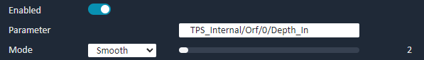
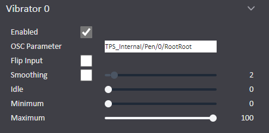

# Avatar Setup (Incomplete)

VibeCheck isn't attached to any unity prefabs/setups. You can use VibeCheck with any animator logic you want to make, as long as you are sending a float parameter to VibeCheck. This could be a single VRChat Contact Receiver script, or a complex feature set where an animator sends different float values to different motors on a toy. This can allow fun interactions with your avatar like slapping a butt or pulling a chain etc.

# Premade Prefabs

**When adding a prefab remember to refresh your avatar's OSC config!**

I have created some prefabs to make setup a bit more simple, if you don't want to setup your avatar completely yourself.

- Simple Contact Receiver
- Constant to float conversion
- Contact rate system

## Simple Contact Receiver

1. Import [VibeCheck Prefab Package]().
2. In the "Simple" folder there is a folder for the default Simple prefab and folder for the TPS prefab.
3. Drag the prefab you want to use onto your Hips and unpack it completely. Keep in mind, the center of the sphere will be the maximum float value / motor speed.
4. If you are setting it up for a penetrator, you will want to put the center of the Contact sphere at the base of the penetrator.
5. If you are setting it up for an oriface just adjust it inside the orifice where you want it.

## Constant to float conversion

1. Import [VibeCheck Prefab Package]().
2. Import [AV3 Manager by VRLabs](https://github.com/VRLabs/Avatars-3.0-Manager/releases/latest).
3. Place VibeCheck_Constant prefab on your avatar wherever you want it.
4. Scale and position the prefab contact receiver how you want it.
5. Using AV3 Manager, merge VibeCheck_Constant_FX controller with your avatar's FX controller.
6. Using AV3 Manager, copy the parameters from VibeCheck_Constant_Parameters into your avatar's parameters.
7. Make a new sub menu in your expressions menu on your avatar. Then input the VibeCheck_Constant_Menu into it.

## Contact rate system

1. Import [VibeCheck Prefab Package]().
2. Import [AV3 Manager by VRLabs](https://github.com/VRLabs/Avatars-3.0-Manager/releases/latest).
3. Place the Orifice or Penetrator prefab where you want it.
5. Scale and position the prefab how you want it.
6. Using AV3 Manager, merge VibeCheck_Rate_FX controller with your avatar's FX controller.
7. Using AV3 Manager, copy the parameters from VibeCheck_Rate_Parameters into your avatar's parameters.
8. Make a new sub menu in your expressions menu on your avatar. Then put the VibeCheck_Rate_Menu into it.

# TPS & VibeCheck

Using TPS with VibeCheck is as easy as setting the float parameters driven by TPS in your toy OSC parameters in the VibeCheck app.

## TPS **Orifice** with VibeCheck

Use the 'TPS_Internal/Orf/0/Depth_In' orifice parameter created by the TPS wizard.

## TPS **Penetrator** with VibeCheck

Use the 'TPS_Internal/Pen/0/RootRoot' penetrator parameter created by the TPS wizard.

